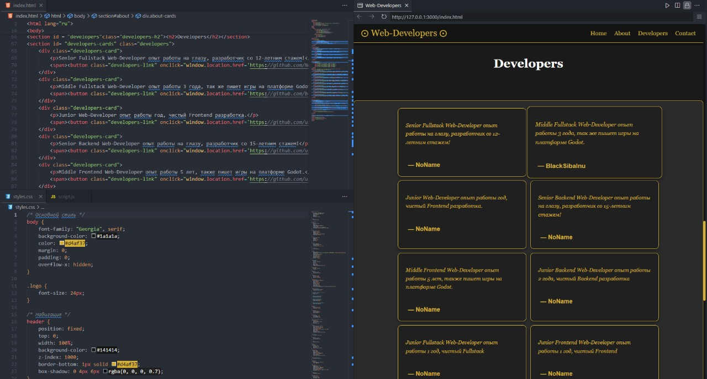

# BSI_Web_Developers_Service - Современный Шаблон услуг веб-программистов



## 📝 Описание
BSI_Web_Developers_Service - это современный, готовый к использованию шаблон веб-приложения для создания услуг веб-разработчиков. Проект разработан с использованием современных веб-технологий и отличается стильным минималистичным дизайном, плавными анимациями и интуитивно понятным интерфейсом.

## ✨ Основные особенности
- **Стильный дизайн Dark Old Money**
- **Адаптивная верстка** для всех устройств
- **Анимированные блоки с работами**
- **Анимированный плавный скрол вниз и верх**
- **Интеграция с EmailJS**
- **Локальное хранение настроек**

## 🛠 Технологический стек
- HTML5
- CSS3
- JavaScript
- EmailJS

## 🎨 Особенности дизайна
- Эффект плавного спуска
- Плавные анимации при наведение курсора
- Кастомные элементы
- Адаптивная цветовая схема

## 🚀 Быстрый старт
1. Клонируйте репозиторий:
```bash
git clone https://github.com/blacksibainu/Template_Web_Developers.git
```

2. Настройте API ключ в файле script.js:
javascript
```bash
emailjs.send(
			"SERVICE_ID",    // Замените на свой Service ID
			"TEMPLATE_ID",   // Замените на свой Template ID
			templateParams
		)

(function() {
		emailjs.init("USER_ID"); // Замените на свой User ID
	})();


```


3. Запустите на локальном сервере

## 💻 Структура проекта
```
BSI_Web_Developers_Service_Templates/
├── index.html
├── styles.css
├── media.css
├── menu.js
├── notification.js
├── emilejs.js
├── script.js
└── README.md
```


## 📱 Совместимость
- Chrome (последние версии)
- Firefox (последние версии)
- Safari (последние версии)
- Edge (последние версии)
- Мобильные браузеры (последние версии)

## 📄 Лицензия
MIT License. Подробности в файле [LICENSE](LICENSE).

## 📊 Статус проекта


## 🙏 Благодарности
- EmailJS за предоставление своих услуг
- Сообществу разработчиков за поддержку [ABU - Corp]

---
⭐ Если вам понравился шаблон, не забудьте поставить звезду!

*Создано с ❤ для сообщества BSI*
